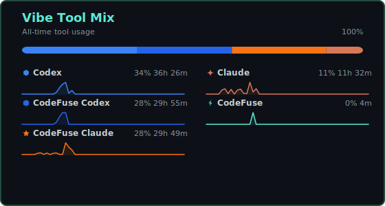
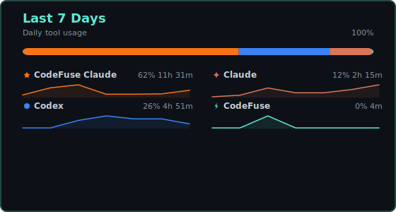

# Li-xingXiao

<!-- vibe-heatmap:start -->
### The AI build streak, 2026
48 active days, 540 sessions, and about 63.9 hours of "wait, try that again" turning into shipped code.

Current vibe bench: Codex 34.3%, CodeFuse Codex 28.6%, CodeFuse Claude 26.5%.

`48 active days` `540 detours survived` `63.9h of prompt-fueled shipping`

 

_Last refreshed: 2026-04-25 23:58 HKT_
<!-- vibe-heatmap:end -->
